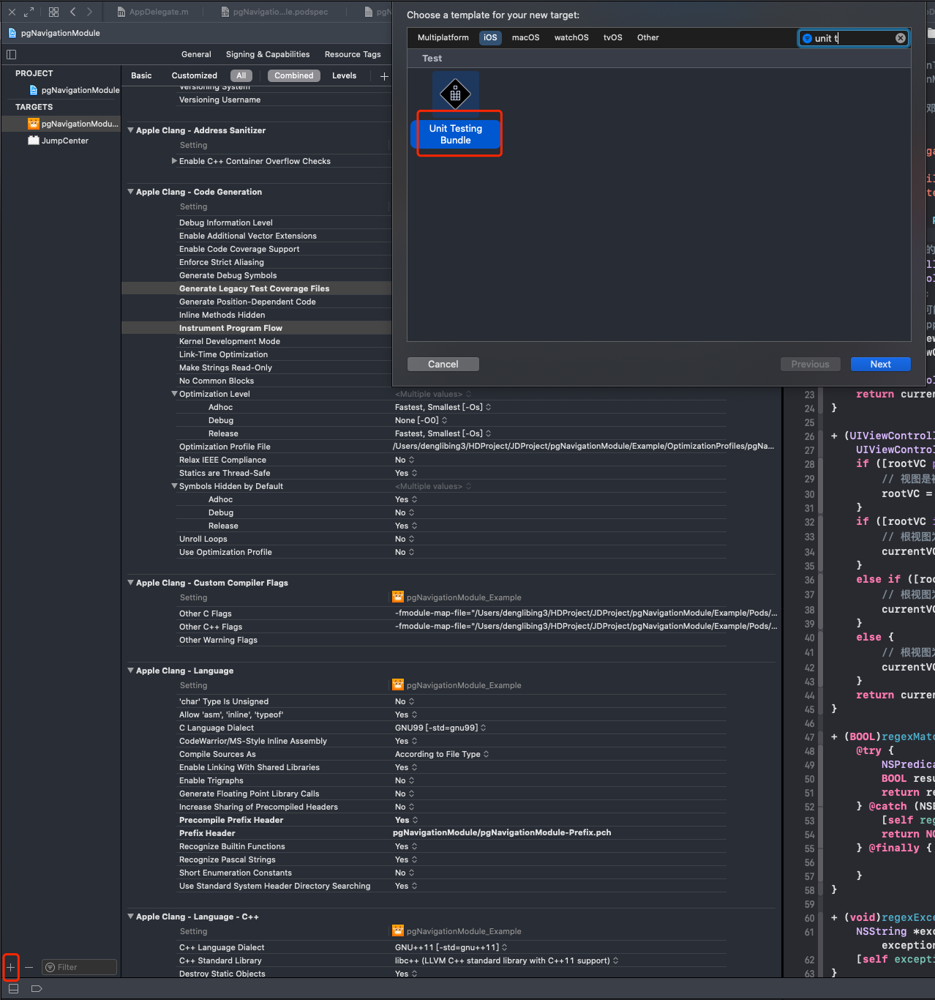
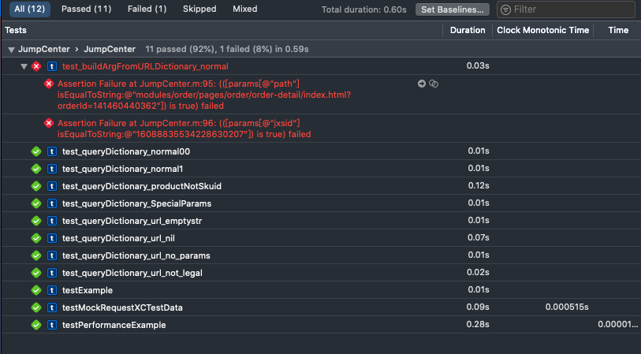

## 单元测试及代码覆盖率

### 一、单元测试

#### **1、背景**

> 京喜App业务端以组件模块进行开发，和其他平行线的业务模块代码复用率很低，经历几十个版本迭代到现在，各种工具代码、通用功能代码几个组件重复率高。

基于这个不合理问题，我们经过内部讨论统计梳理，整理了通用功能及相关以前负责人文档一般后续开发维护。

[京喜App基础组件统计](https://cf.jd.com/pages/viewpage.action?pageId=468015964)、[iOS基础组件分类](https://cf.jd.com/pages/viewpage.action?pageId=472491833)

为了保证迁移代码的稳定性及扩展性（不再是被自己的业务组件使用），要求基础组件的代码需要有单元测试，保证单元测试通过及代码的覆盖率达到100%


#### **2、会有哪些问题？**

**2.1、维护成本大**

```
往往一个方法需要10甚至100+条测试用例进行验收，前期投入不少时间
```

**2.2、单元测试通过并不完全代表没有问题**

```
代码有好坏，对应的测试用例也如此，不能完全寄托测试用例的通过而忽略复杂的线上环境
```


#### **3、会带来哪些价值？**

**3.1、减少对宿主App的依赖**

```
现在很多基础API的改动无法快速的验证，需要依赖App的发包进行验证，而现在即使是最轻量的组件改动后打包给测试同学，至少是15+分钟。一旦被其他事情打断，整个流程耗时会无法统计的增加。
```

**3.2、减少调试时间**

```
单元测试不依赖UI，不需要启动App甚至组件的Demo工程，大部分是1秒内可以验证得到结果。
```

**3.3、可维护性增强**

```
单元测试是一次次累积的，没一个场景下，需要有对应的用例，一旦这个方法积累了迭代版本的测试用例，后续的新增修改，可以全量过一次该方法的用例，大部分是1秒内可以验证得到结果。这个必然是良性循环。
```

**3.4、减少低级错误**

```
因为自信或者网上代码或者惯性思维导致的一些低级错误也频频发生，通过简单的测试用例完全可以避免这些低级错误
```

**3.5、改善代码设计**

为了更有效率地执行单元测试，需要反推API更合理

```
i、行为应该设计单一
ii、考虑复用性
iii、代码细节得到更加充分地测试
```


#### **4、单元测试代码三部曲**

如何比较好的来编写一个测试用例，保证你每个测试用例所针对的仅仅是一个基本单元，而不是一个有很多复杂依赖的综合行为。对此，有很多不同的做法，而这也并没有一个标准，也不需要有一个标准。我们需要清楚一个测试用例存在的意义是什么，命名规则要求是 `test_测试方法签名_测试意图`

基本要领：验证某个类的某个API在某种上下文中能得到预期的结果

对应的三部曲（GWT）：

4.1、提供数据源（Give）：准备阶段，准备输入参数，设定上下文

4.2、执行任务（When）：执行代码，并且获取返回结果

4.3、断言结果（Then）：判断结果是否是预期结果


#### 5、单元测试实践

基于iBiu创建单元测试Target：



创建之后

**5.1、代码结构：**

```objc
+ (void)setUp {
    // 该文件只初始化一次
}

- (void)setUp {
    // 每次执行一个Case都会执行，这里可以初始化数据
}

- (void)tearDown {
		// 每次执行完Case都会执行，这里可以清理数据
}

- (void)testExample {
   	// 这里就是我们的测试代码
	  NSString *url = nil;
    NSDictionary *params = [PGNavigationTool queryDictionary:url];
    NSLog(@"params: %@", params);

    XCTAssertNil(params);
}

- (void)DISABLED_buildArgFromURL_productNotSkuid {
  	// 这个表示该Case已经废弃
}
```

**5.2、测试覆盖维度：**

```
1、单个测试用例进行测试
2、单文件进行测试
3、指定工程进行测试
```

**5.3、测试结果验证：**

```objective-c
XCTFail(format…) 	// 生成一个失败的测试；
XCTAssertNil(a1, format...)	// 为空判断，a1为空时通过，反之不通过；
XCTAssertNotNil(a1, format…)	// 不为空判断，a1不为空时通过，反之不通过；
XCTAssert(expression, format...)	// 当expression求值为TRUE时通过；
XCTAssertTrue(expression, format...)	// 当expression求值为TRUE时通过；
XCTAssertFalse(expression, format...)	// 当expression求值为False时通过；
XCTAssertEqualObjects(a1, a2, format...)	// 判断相等，[a1 isEqual:a2]值为TRUE时通过，其中一个不为空时，不通过；
XCTAssertNotEqualObjects(a1, a2, format...)	// 判断不等，[a1 isEqual:a2]值为False时通过；
XCTAssertEqual(a1, a2, format...)	// 判断相等（当a1和a2是 C语言标量、结构体或联合体时使用,实际测试发现NSString也可以）；
XCTAssertNotEqual(a1, a2, format...)	//判断不等（当a1和a2是 C语言标量、结构体或联合体时使用）；
XCTAssertEqualWithAccuracy(a1, a2, accuracy, format...)	// 判断相等，（double或float类型）提供一个误差范围，当在误差范围（+/-accuracy）以内相等时通过测试；
XCTAssertNotEqualWithAccuracy(a1, a2, accuracy, format...) // 判断不等，（double或float类型）提供一个误差范围，当在误差范围以内不等时通过测试；
XCTAssertThrows(expression, format...)	// 异常测试，当expression发生异常时通过；反之不通过；（很变态） 
XCTAssertThrowsSpecific(expression, specificException, format...) // 异常测试，当expression发生specificException异常时通过；反之发生其他异常或不发生异常均不通过；
XCTAssertThrowsSpecificNamed(expression, specificException, exception_name, format...)	// 异常测试，当expression发生具体异常、具体异常名称的异常时通过测试，反之不通过；
XCTAssertNoThrow(expression, format…)	// 异常测试，当expression没有发生异常时通过测试；
XCTAssertNoThrowSpecific(expression, specificException, format...)	// 异常测试，当expression没有发生具体异常、具体异常名称的异常时通过测试，反之不通过；
XCTAssertNoThrowSpecificNamed(expression, specificException, exception_name, format...)	// 异常测试，当expression没有发生具体异常、具体异常名称的异常时通过测试，反之不通过
```

**5.4、输出结果：**



**5.5、后续计划：**

```
1、测试用例代码脚手架实现，根据类自动生成相应测试用例，减少手动执行
2、现在测试用例数据，存在不全面的问题，需要线上数据收集，然后自动化测试
```


#### 6、性能测试

> 性能测试主要使用 `measureBlock` 方法 ，用于测试一组方法的执行时间，通过设置baseline（基准）和stddev（标准偏差）来判断方法是否能通过性能测试。

```objective-c
- (void)testPerformanceExample {
    // This is an example of a performance test case.
    [self measureBlock:^{
				[pgNavigationManager pgJumpCenterByH5URL:url currentVC:nil arg:nil completion:nil];
    }];
}
```

在 `跳转中心组件`  单独测试，耗时如下：


在 `京喜App`  主工程集成测试，耗时如下：


**注意点1**：基于 `iBiu` 上开发测试性能测试，如果需要依赖其他组件环境，无法通过target依赖对应组件实现。需要手动设置依赖组件的Framework的path来实现：


**注意点2**：基于 `iBiu` 开发，依赖外部的第三方mock组件，需要使用 `Podfile.custom` 来扩展能力

```ruby
source 'https://github.com/CocoaPods/Specs.git'
pod 'OCMock'
```


#### 7、异步测试

```objc
- (void)testTimeConsuming {
    XCTestExpectation *expect = [[XCTestExpectation alloc] initWithDescription:@""];
    [self _testTimeout:^{
        [expect fulfill];
    }];
    [self waitForExpectations:@[expect] timeout:2];
}

- (void)_testTimeout:(void (^)(void))handle {
    dispatch_after(dispatch_time(DISPATCH_TIME_NOW, (int64_t)(2 * NSEC_PER_SEC)), dispatch_get_main_queue(), ^{
        handle();
    });
}
```


### 二、代码覆盖率

[有赞iOS精准测试实践](https://tech.youzan.com/ios-code-coverage/) 代码覆盖率原理

[唯品会iOS代码覆盖率的应用实践](http://blog.itpub.net/69900365/viewspace-2636946/) 代码覆盖率原理

[iOS 覆盖率检测原理与增量代码测试覆盖率工具实现（美团）](https://tech.meituan.com/2018/12/27/ios-increment-coverage.html) 代码覆盖率原理

[iOS 测试 iOS-客户端代码覆盖测试 (Gcov)](https://testerhome.com/topics/19375) ：解释iOS端如何实现代码覆盖率，无原理

[代码覆盖率测试gcov和lcov](https://www.codeleading.com/article/9723949031/) 解释了gcov和lcov的功能和区别


> 使用lcov进行统计和分析线上代码覆盖率，主要支持OC，不支持Swift

#### 1、项目配置

Xcode设置Build Settings的  `Generate Legacy Test Coverage Files` 和 `Instrument Program Flow` 为 `YES`

主要是收集 `gcno` , 用于将编译阶段的代码信息收集，以便和运行时进行对比计算代码覆盖率。


项目运行后，找到 `gcno` 文件：


`gcno` 文件路径在：` /Users/denglibing/Library/Developer/Xcode/DerivedData/HDCoverageDemo-ebhseosomyludgdhoyoupffqussp/Build/Intermediates.noindex/HDCoverageDemo.build/Debug-iphonesimulator/HDCoverageDemo.build/Objects-normal/x86_64 `

这里会收集本次编译运行的所有 `gcno` 文件


#### 2、收集运行时代码执行信息

主要收集 `gcda` 文件

在 AppDelegate.m 的 didFinishLaunchingWithOptions 函数中，加入以下代码：

```swift
func application(_ application: UIApplication, didFinishLaunchingWithOptions launchOptions: [UIApplication.LaunchOptionsKey: Any]?) -> Bool {
    // Override point for customization after application launch.
    var coverageFile = NSSearchPathForDirectoriesInDomains(.documentDirectory, .userDomainMask, true).first
    coverageFile?.append("/coverageFiles")
    if let coverageFile = coverageFile {
        debugPrint("coverageFile: \(coverageFile)")
        // setenv的意思是将数据的根目录设置为app的Documents
				setenv("GCOV_PREFIX", coverageFile.cString(using: .utf8), 1)
        // setenv的意思是strip掉一些目录层次，因为覆盖率数据默认会写入一个很深的目录层次
        setenv("GCOV_PREFIX_STRIP", "13", 1)
    }
    return true
}
```

存储代码执行信息，可以在App退到后台，或者在App设置页面主动点击收集存储，代码如下：

```swift
// https://stackoverflow.com/questions/51488887/
// swift 代码使用 extern 需要使用OC做桥接

extern void __gcov_flush(void);

func sceneDidEnterBackground(_ scene: UIScene) {
    // Called as the scene transitions from the foreground to the background.
    // Use this method to save data, release shared resources, and store enough scene-specific state information
    // to restore the scene back to its current state.
    
    DispatchQueue.main.asyncAfter(deadline: .now() + 3) {
        __gcov_flush();
    }
}
```

项目运行后，经过一系列的测试，App退到后台，相关数据就会写入到  `coverageFile`目录中，模拟器可以直接打开，真机可以将这些文件接口上报到云端进行收集。

打开 `coverageFile` 目录如下：


说明的确只能对 `OC` 代码进行收集计算覆盖率

#### 3、计算覆盖率和数据可视化

将前面两步收集的到的 `gcno`  和 `gcda` 复制到同一个目录，将项目源码也负责到该目录中（如果没有这个操作，执行 lcvo 失败，后面的注意点会提到 **具体见4.3**）

```sh
➜  HDCoverageDemo ls
HDCoverageDemo  HDOC.gcda       HDOC.gcno

➜  HDCoverageDemo tree -L 2
.
├── HDCoverageDemo
│   ├── AppDelegate.swift
│   ├── Assets.xcassets
│   ├── Base.lproj
│   ├── HDCoverage.h
│   ├── HDCoverageDemo-Bridging-Header.h
│   ├── HDOC.h
│   ├── HDOC.m
│   ├── Info.plist
│   ├── SceneDelegate.swift
│   └── ViewController.swift
├── HDOC.gcda
└── HDOC.gcno


# lcov官网说明： http://ltp.sourceforge.net/coverage/lcov.php
# 生成 hdcoverage.info 文件
➜  HDCoverageDemo lcov -c -d . -o hdcoverage.info
Capturing coverage data from .
Found LLVM gcov version 12.0.0, which emulates gcov version 4.2.0
Scanning . for .gcda files ...
Found 1 data files in .
Processing HDOC.gcda
Finished .info-file creation
➜  HDCoverageDemo ls
HDCoverageDemo  HDOC.gcda       HDOC.gcno       hdcoverage.info

# 生成html文件，记录代码执行的覆盖率
➜  HDCoverageDemo genhtml -o html hdcoverage.info
Reading data file hdcoverage.info
Found 1 entries.
Found common filename prefix "/Users/denglibing/HDProject/desktop/dmfgl/HDCoverageDemo"
Writing .css and .png files.
Generating output.
Processing file HDCoverageDemo/HDOC.m
Writing directory view page.
Overall coverage rate:
  lines......: 100.0% (15 of 15 lines)
  functions..: 100.0% (1 of 1 function)
➜  HDCoverageDemo ls
HDCoverageDemo  HDOC.gcda       HDOC.gcno       hdcoverage.info html
```

查看结果：

整体情况：


某个类的执行情况：


**将上面的脚本汇总，一步到位：**

```sh
➜  HDCoverageDemo ls
HDCoverageDemo  HDOC.gcda       HDOC.gcno  lcov.sh

➜  HDCoverageDemo sh lcov.sh
Capturing coverage data from .
Found LLVM gcov version 12.0.0, which emulates gcov version 4.2.0
Scanning . for .gcda files ...
Found 1 data files in .
Processing HDOC.gcda
Finished .info-file creation
Reading data file hdcoverage.info
Found 1 entries.
Found common filename prefix "/Users/denglibing/HDProject/desktop/dmfgl/HDCoverageDemo"
Writing .css and .png files.
Generating output.
Processing file HDCoverageDemo/HDOC.m
Writing directory view page.
Overall coverage rate:
  lines......: 80.0% (12 of 15 lines)
  functions..: 100.0% (1 of 1 function)
```

`lcov.sh文件` 代码如下：

```sh
# lcov.sh文件
lcov -c -d . -o hdcoverage.info

if [ $? -eq 0 ]; then
	genhtml -o html hdcoverage.info
else
	echo "lcov faild"
fi
```


#### 4、常见问题：

4.1、找不到 `lcov` 命令，请查看官方文档，或者终端执行 `brew install lcov`


4.2、执行  `lcov -c -d ./ -o hdcoverage.info` 报错：**"File checksums do not match: 4271174018 != 3267742850."**

```sh
➜  HDCoverageDemo lcov -c -d ./ -o hdcoverage.info
Capturing coverage data from ./
Found LLVM gcov version 12.0.0, which emulates gcov version 4.2.0
Scanning ./ for .gcda files ...
Found 1 data files in ./
Processing HDOC.gcda
File checksums do not match: 4271174018 != 3267742850.
Invalid .gcda File!
geninfo: WARNING: gcov did not create any files for /Users/denglibing/HDProject/desktop/dmfgl/HDCoverageDemo/HDOC.gcda!
Finished .info-file creation
```

表示 `gcda` 和  `gcov`  文件没有成对生成，导致对不上。删除重新跑一次


4.3、执行  `lcov -c -d ./ -o hdcoverage.info` 报错：**"HDCoverageDemo/HDOC.m: No such file or directory"**

```sh
➜  HDCoverageDemo lcov -c -d . -o hdcoverage.info
Capturing coverage data from .
Found LLVM gcov version 12.0.0, which emulates gcov version 4.2.0
Scanning . for .gcda files ...
Found 1 data files in .
Processing HDOC.gcda
HDCoverageDemo/HDOC.m: No such file or directory
Finished .info-file creation
```

这个网上也有人遇到过，没有找到解决方案，但是根据错误提示，只要将项目的源码也复制到  `gcda`  同一个目录即可。虽然已经解决，但是不确认是否是最优解，并且这样会带来一定的工作量，而且在没有源码或者使用framework的情况下，不确定是否能计算代码覆盖率。

 

4.4、依赖的framework或者ibiu组件测试代码覆盖率，Xcode设置framework的Build Settings的  `Generate Legacy Test Coverage Files` 和 `Instrument Program Flow` 为 `YES`


对 framework 进行编译后，也和工程找 `gcno`  一样找到 framework 的文件，`gcda` 和项目工程是在一起。这里麻烦的是，需要把framework 的源码也找到，并且和 `gcno` 和 `gcda` 放一起:

```sh
➜  HDCoverageDemo tree -L 2
.
├── HDCoverFramework							# framework 的源码
│   ├── HDCoverFramework.h
│   ├── HDOCFramework.h
│   ├── HDOCFramework.m
│   └── Info.plist
├── HDCoverageDemo								# 项目工程的源码
│   ├── AppDelegate.swift
│   ├── Assets.xcassets
│   ├── Base.lproj
│   ├── HDCoverage.h
│   ├── HDCoverageDemo-Bridging-Header.h
│   ├── HDOC.h
│   ├── HDOC.m
│   ├── Info.plist
│   ├── SceneDelegate.swift
│   └── ViewController.swift
├── HDOC.gcda											# 工程中源码执行的数据
├── HDOC.gcno											# 工程中源码的插桩数据
├── HDOCFramework.gcda						# framework中源码执行的数据
├── HDOCFramework.gcno						# framework中源码执行的数据中源码的插桩数据
└── lcov.sh

4 directories, 17 files


➜  HDCoverageDemo sh lcov.sh 
Capturing coverage data from .
Found LLVM gcov version 12.0.0, which emulates gcov version 4.2.0
Scanning . for .gcda files ...
Found 2 data files in .
Processing HDOC.gcda
Processing HDOCFramework.gcda
Finished .info-file creation
Reading data file hdcoverage.info
Found 2 entries.
Found common filename prefix "/Users/denglibing/HDProject/desktop/dmfgl/HDCoverageDemo"
Writing .css and .png files.
Generating output.
Processing file HDCoverFramework/HDOCFramework.m
Processing file HDCoverageDemo/HDOC.m
Writing directory view page.
Overall coverage rate:
  lines......: 90.0% (27 of 30 lines)
  functions..: 100.0% (2 of 2 functions)
  
  
在当前路径生成 html 文件夹
➜  HDCoverageDemo ls
HDCoverFramework   HDOC.gcda          HDOCFramework.gcda hdcoverage.info    lcov.sh
HDCoverageDemo     HDOC.gcno          HDOCFramework.gcno html
```

打开 `html` 中的  `index.html` , 即可查看工程和framework的代码覆盖率：

 


4.5、基于 `cocoapods`  组件开发实现代码覆盖率问题。


> 使用 XcodeCoverage 进行计算
